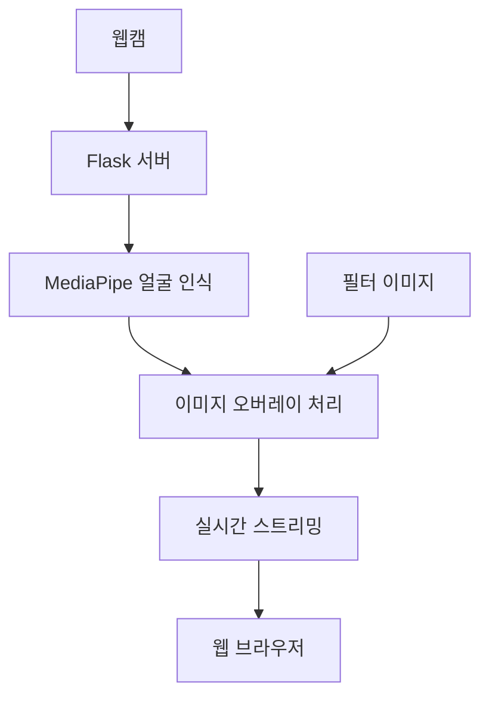
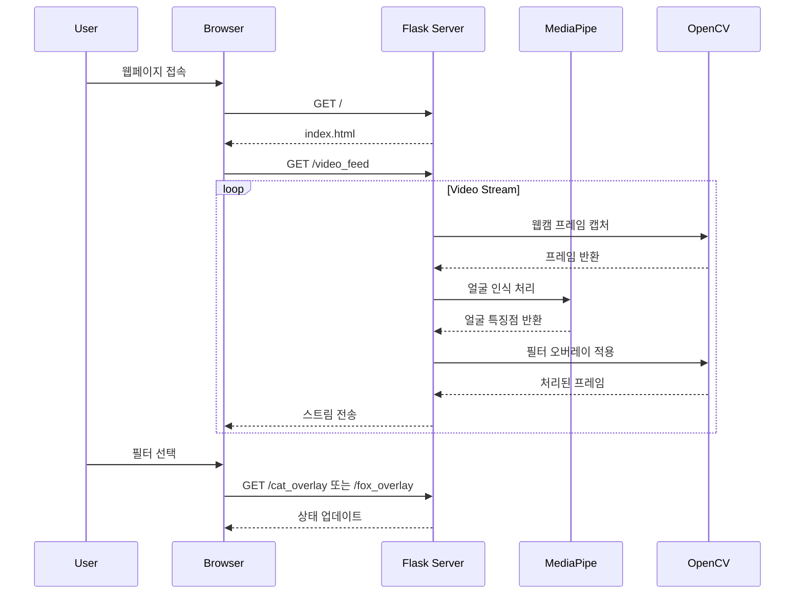

# Face Character Emoji - 실시간 얼굴 필터 웹 애플리케이션

## 📌 프로젝트 소개
Face Character Emoji는 웹캠을 통해 실시간으로 사용자의 얼굴을 인식하고 재미있는 동물 캐릭터 필터를 적용할 수 있는 웹 애플리케이션입니다. MediaPipe의 얼굴 인식 기술과 Flask 웹 프레임워크를 활용하여 개발되었습니다.

## 🎯 주요 기능
- 실시간 웹캠 영상 처리
- MediaPipe를 활용한 정확한 얼굴 인식
- 다양한 동물 캐릭터 필터 (고양이, 여우)
- 웹 인터페이스를 통한 간편한 필터 전환
- 실시간 이미지 오버레이 처리

## 🛠 기술 스택
- **Backend**: Python, Flask
- **Computer Vision**: OpenCV, MediaPipe
- **Frontend**: HTML, JavaScript
- **이미지 처리**: PIL(Pillow)

## 🔍 시스템 아키텍처


## ⚙️ 설치 방법
1. 가상환경 생성 및 활성화
```bash
python -m venv face-emoji
.\face-emoji\Scripts\Activate  # Windows
```

2. 필요한 패키지 설치
```bash
pip install -r requirements.txt
```

3. 애플리케이션 실행
```bash
python main.py
```

4. 웹 브라우저에서 접속
http://localhost:5000

## 📁 프로젝트 구조
face_character_emoji/
│
├── main.py # Flask 애플리케이션 메인 파일
├── animal_overlay_filter.py # 동물 필터 처리 로직
├── image_overlay.py # 이미지 오버레이 유틸리티
│
├── templates/ # HTML 템플릿
│ └── index.html
│
├── images/ # 필터 이미지 리소스
│ ├── cat_left_ear.png
│ ├── cat_right_ear.png
│ ├── cat_nose.png
│ ├── fox_left_ear.png
│ ├── fox_right_ear.png
│ └── fox_nose.png
│
└── requirements.txt # 프로젝트 의존성 파일


## 💻 주요 기능 상세 설명
### 1. 실시간 얼굴 인식
- MediaPipe Face Detection을 사용하여 정확한 얼굴 특징점 추출
- 눈, 코 위치를 실시간으로 감지하여 필터 위치 조정
- 얼굴 움직임에 따른 자연스러운 필터 적용

### 2. 필터 시스템
- 고양이와 여우 캐릭터 필터 제공
- 실시간 필터 전환 기능
- 얼굴 특징점 기반 정확한 필터 포지셔닝

### 3. 웹 인터페이스
- 직관적인 필터 선택 UI
- 실시간 웹캠 피드백
- 반응형 디자인

## 🔄 시스템 프로세스 흐름도


## 🌟 핵심 구현 사항
1. **실시간 얼굴 인식 및 추적**
   - MediaPipe 라이브러리를 활용한 고성능 얼굴 인식
   - 실시간 처리를 위한 최적화된 알고리즘 구현

2. **필터 오버레이 시스템**
   - 투명도를 지원하는 PNG 이미지 처리
   - 얼굴 특징점 기반 동적 위치 조정
   - 부드러운 필터 전환 효과

3. **웹 스트리밍 최적화**
   - 효율적인 비디오 스트리밍 구현
   - 실시간 이미지 처리 성능 최적화

## 🔧 개발 환경
- Python 3.8+
- Windows 10
- WebCam 필요

## 🎉 프로젝트 특징
- 실시간 얼굴 인식과 필터 적용의 매끄러운 통합
- 사용자 친화적인 웹 인터페이스
- 확장 가능한 필터 시스템 설계
- 실시간 처리 최적화
